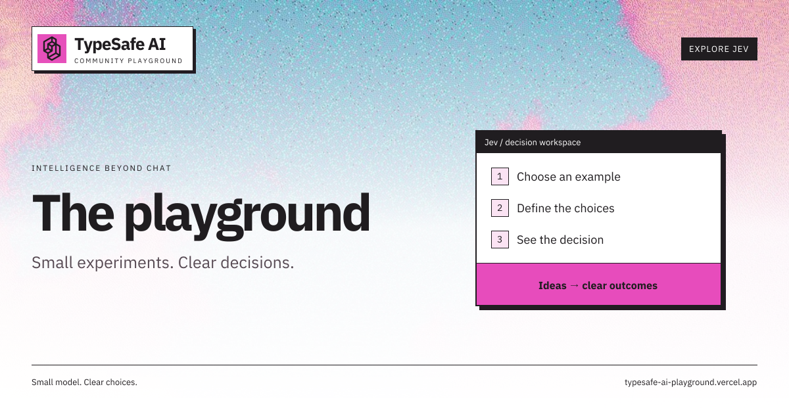

# TypeSafe AI Playground

A community playground for **Jev**: run small classification experiments, route conversations, apply decision rules, extract document fields, review code changes, verify logic, test memes, and drive a robot duck.

**Shout-out to [@nickthompson480](https://github.com/nickthompson480) for the [original TypeSafe AI playground](https://github.com/nickthompson480/typesafe-ai-playground).** This fork builds on that project's example library and Python foundation with a Next.js interface and new interactive prototypes. This is an independent community project, not an official TypeSafe AI product.

[Open the live playground](https://typesafe-ai-playground.vercel.app) · [TypeSafe API documentation](https://docs.typesafe.ai/introduction/quickstart) · [Contributing](CONTRIBUTING.md)



## Run locally

Requires **Node.js 22 or newer**. A TypeSafe API key is needed for live Jev evaluations.

```sh
git clone https://github.com/BunsDev/typesafe-ai-playground.git
cd typesafe-ai-playground
npm ci
cp .env.example .env.local
# Edit .env.local and set TYPESAFE_API_KEY.
npm run dev
```

Open the address printed by Next.js, normally http://localhost:3000. To choose another port, use `npm run dev -- --port 3001`.

`TYPESAFE_API_KEY` is read only by the server. Do not prefix it with `NEXT_PUBLIC_`, hardcode it in a component, or commit `.env.local`. You can browse and edit examples without a key; Live Jev actions require one. Mock governance/PR demos and exact Z3 checks do not.

## Fourteen workspaces

| Workspace                             | What it does                                                                                                                       |
| ------------------------------------- | ---------------------------------------------------------------------------------------------------------------------------------- |
| **Examples** `/`                      | 110 examples across 22 categories, including 41 A/B comparisons. Edit input and questions, run Jev, and inspect typed answers.      |
| **Conversation lab** `/conversation`  | Paste raw Discord or labeled chat, rank potential reply recipients, compare context, and evaluate conversation frames.              |
| **Ask gate** `/gate`                  | Decide whether an incoming question needs a human, or whether the channel or the docs already answered it, with the exact line cited. |
| **Workflow chat** `/workflow`         | Describe a case and apply editable decision rules. Missing evidence produces a follow-up question.                                  |
| **Document extraction** `/extraction` | Find likely values locally, then ask Jev to select candidates or `null`, with probabilities and source evidence.                    |
| **PR review** `/pr-review`            | Paste a public PR link or diff; classify hunks and queue uncertain changes for review.                                              |
| **AST governance** `/ast-governance`  | Trace changed symbols and callers, apply deterministic policy, and classify ambiguous findings. Includes a simulated test cache.    |
| **SMT solver** `/smt-solver`          | Compare closed-set Jev predictions with real Z3 checks, independent-group decomposition, and measured benchmarks.                   |
| **Tool router** `/tool-router`        | Follow a LangGraph-style mock workflow with closed-set node selection, policy blocks, approval gates and a step log.                |
| **LangChain** `/langchain`            | Invoke a real LangChain routing tool with live or mocked Jev predictions; inspect typed policy-gated output.                        |
| **Vector reranker** /reranker         | Compare vector order, batched Jev relevance, and an explicit lexical mock baseline. Inspect rank disagreements and source snippets. |
| **Jev plays Doom** `/doom`            | Play an original browser maze shooter, hand control to Jev, and compare against a seeded random baseline.                           |
| **Meme lab** `/memes`                 | Test humor style, audience fit, tone, and likely confusion using captions or reviewed text from an image URL.                       |
| **MicroDuck arena** `/microduck`      | Drive a grid robot one tick at a time: nine sensor fields in, one of seven actions out, against a random baseline.                  |

The supplied TypeSafe [banner](https://pbs.twimg.com/profile_banners/2014504062797152256/1789084216/1500x500) and [profile mark](https://pbs.twimg.com/profile_images/2100293691227447296/bVoZ2u00_400x400.jpg) are stored locally in public/brand. The social images use IBM Plex Sans, distributed with its [SIL Open Font License](public/brand/OFL.txt). This remains an unofficial community playground.

Every page has its own 1200 × 630 Open Graph image and Twitter preview. A shared branded template keeps route titles, descriptions and images consistent.

The interface follows TypeSafe’s pink/sky-blue dithered artwork, geometric mark, bold sans-serif headlines, monospace labels, and compact window borders. Light and dark themes share the same responsive layout. Desktop panels scroll independently; narrow screens stack content. Examples has a collapsible Results rail, which opens when a run begins. Mobile controls have larger touch targets, and reduced-motion preferences are respected.

### Examples

Search by name, filter by collection or category, or show only A/B comparisons. The library shows the matching count and a **Clear filters** action. On mobile, **Browse examples** expands the library without crowding the setup. Numbered setup sections guide you through the input and questions. Include questions directly from each row, then expand them to edit instructions. Edit the state as text or JSON. **Edit all questions as JSON** also lets you change types and candidate definitions. Apply those edits before running.

**Reset draft** restores the selected example and offers **Undo reset**. Setup validation explains missing questions or invalid input before a request is sent. The A/B preview shows the exact field and both values; a missing comparison field disables only the comparison. Click anywhere along the collapsed Results rail to open it, or use the keyboard.

**Run example** sends one request. **Compare A/B**, available on paired examples, sends two requests with a declared change to the input. The plus button creates a blank custom example. Drafts and custom examples are saved in browser storage for that origin. **Export library** and **Import** move them between browsers; imported ID collisions become copies. Results are not restored after refresh.

The catalog includes practical use cases, games, dilemmas, and model challenges. Puzzle reference notes are teaching aids; subjective judgments have no universal answer key. A single run or A/B difference is not an accuracy or fairness benchmark.

### Conversation lab

Paste Discord messages with names and timestamps, `Name: message` text, or plain text. Auto-detection preserves multiline messages; **Parsed messages** lets you inspect the result or override the format.

- **Who gets the reply?** evaluates each speaker's latest message using only preceding context. Requests run in batches of three. The highest score above your threshold wins; ties, no-reply outcomes, and incomplete runs remain explicit.
- **Compare context (A/B)** compares full context with the final message alone.
- **Evaluate final message** sends one full-context request.

The winning message gets a full source preview with its speaker and timestamp; other messages appear in ranked cards with expandable previews. Ties and unscored candidates remain explicit. Changing the reply threshold recomputes decisions locally. Optional expected-frame labels build session confusion matrices; changing the transcript or format clears the label. Exports include the run input, rows, threshold, and selected recipient. No messages are sent to Discord.

### Ask gate

A busy channel answers the same question repeatedly. The gate triages one incoming question, or a whole dump, against the recent conversation and any docs or FAQ text you paste.

Jev picks one of four outcomes — `already_answered`, `answerable_by_docs`, `needs_human`, `needs_more_context` — plus the single prior message or documentation line that justifies it. It never writes the answer: suggested replies are fixed templates that quote the cited evidence.

- **One question** gates a single message against the last 20 messages of context.
- **Batch** gates every question in a dump against only the messages above it, three requests at a time, and tallies how many could have been avoided by reading up.

`needs_human` is the fallback for everything the gate cannot stand behind: an unrecognized outcome, a missing confidence score, a match below the confidence slider, or a claim with nothing cited. When Jev picks `already_answered` but cites a documentation line — or the reverse — the gate reports the outcome its citation actually supports and shows both. Moving the confidence slider re-decides locally without new requests.

The seeded sample is a support channel where three questions repeat earlier answers, one is covered by the FAQ, one is genuinely new, and one is too vague to act on.

### Workflow chat

Choose one of five playbooks: **damaged delivery**, **account recovery**, **duplicate payment**, **service incident**, or **expense approval**. Each has a seeded incomplete case and a fixed follow-up question. The delivery playbook handles sender-caused damage, delivery damage, first buyer-caused incidents, and repeat buyer-caused incidents. Edit rules before starting a case. Jev must identify a supported rule before the UI recommends its configured action; otherwise it asks for more facts.

**Recommendations only:** this prototype does not refund customers, fine delivery services, resend items, or ban accounts. Start a new case to change the rules. Export a case to save its conversation.

### Document extraction

Paste raw document text and select `date`, `counterparty`, `amount`, or `document_type`. An invoice sample is included.

1. `extractCandidates(text)` uses lightweight rules to find exact source values.
2. `rankWithJev(field, candidates, text)` submits named candidates plus `null` as a closed set.
3. `runExtraction(text)` coordinates the selected fields, with up to three requests in parallel.

Results show the selected value, its Jev probability, confidence when returned, every candidate, and a source snippet. Evidence is copied from the document, not generated. Empty candidate sets return local `null` without an API call; failures are distinct from null selections. See [the extraction guide](docs/document-extraction.md) for limits and module details.

### PR Review

Paste a PR URL or diff and click **Review PR**. The lab loads public PR metadata automatically, preserves every hunk as evidence, and uses fixed labels and rule candidates. Thresholds control safe skips, review queues, and candidate blocks. **Why this decision** traces priority hunks from model labels through gates to a route, with direct links to the original diff. Try the clearly labeled mock auth-change demo without an API call. No GitHub actions or second-stage LLM calls are performed. See [PR Review setup and limits](docs/pr-review.md).

### AST-aware governance

Start with **Run mock demo** for an auth-signature change with a missed caller and missing test updates. The page explains what changed, how callers are affected, why each policy applies, and what to check next. **Analyze changes** runs local static checks; **Classify with Jev** uses only fixed outcomes. Sensitive-file changes block before any Jev call. The parser, symbol index, and test-cache workflow are prototypes; no code, tests, or merges are executed. See the [governance guide](docs/ast-governance.md).

### SMT solver lab

Choose a scenario card or write Boolean, integer, equality, ordering or scheduling rules, then choose **Run Check**. Plain-language prompts, live rule/variable counts, and a keyboard shortcut guide the input; advanced options stay collapsed. Jev predicts one of four outcomes; Z3 verifies the full problem on the server and wins any definitive disagreement. Independent groups run through Jev in parallel. Confidence below 85% requires decomposition. Five seeded cases populate a measured benchmark table on demand. See [syntax, decomposition, routing and benchmark limits](docs/smt-solver.md).

### Jev tool router

**Run Routing Step** chooses among the current node’s allowed outgoing edges. Fixed policy removes blocked tools, stops sensitive requests before Jev, and pauses configuration changes for explicit mock approval. Low confidence asks for clarification. Try read settings, change production, and request a secret; the step log shows each transition. All agents and tools are simulated. See [the Tool Router guide](docs/tool-router.md).

### Vector reranker

Load the synthetic Blink-style code-search sample or paste a JSON candidate list. Choose K (20–200, capped by the supplied list), then **Compare both** for the default three-column comparison. Jev processes ten candidates per request with three requests in parallel. Unknown or failed classifications stay unscored and suppress aggregate metrics.

Top-10 overlap, rank correlation, measured latency, configurable cost estimates, and large rank differences help inspect results. The local baseline is a lexical mock, not a neural reranker or a quality ground truth. See [the reranker module](docs/reranker.md) for scoring and adapter details.

### Jev × LangChain

A real `@langchain/core` tool validates input with Zod, routes through the shared Jev/policy logic, and returns structured data without executing downstream actions. Use **Invoke LangChain tool** for live Jev or **Try mock invocation** for seeded predictions. `npm run example:langchain` runs the tool in a RunnableLambda chain; add `-- --live` to use your configured key. This is a local integration example, not a published plugin. See [setup and adapter usage](docs/langchain.md).

### Meme lab: text, images, and a meta meme

The starter **Meme lab meets itself** image jokes about this very interface: “I built a meme lab to validate my humor. The meme lab: insufficient evidence.” Download it from the preview or test its supplied captions. The pictured result is part of the joke, not an actual Jev verdict.

To test another image:

1. Paste a **public HTTPS image address**, then choose **Read image**.
2. Review and correct **Recognized image text**.
3. Add visual context and the intended audience, then choose **Test meme**.

The image loader accepts PNG, JPEG, WebP, and GIF files up to 4 MB and 20 megapixels. It follows at most three redirects, blocks private/reserved network addresses, pins the resolved connection, and normalizes images to a maximum of 2,000 pixels per side. Animated GIFs use the first frame.

English OCR runs in your browser using a lazily loaded Tesseract worker. It compares a standard pass with a contrast pass for outlined white lettering, rejects low-confidence fragments, and uses large vertical gaps to suggest setup and punchline. Identical captions in separate panels are preserved. Review both fields: OCR can confuse letters such as `I` and `l`, and the spatial split does not interpret the joke or handle every layout. Its runtime and language data load from Tesseract's configured public CDNs. If recognition fails or finds no caption, you can enter text and context manually. Loading an image does **not** call Jev.

**Jev evaluates the reviewed text and visual description, not image pixels.** URLs are not a substitute for visual context. The output is a closed-set humor/tone classification, possible confusion, and an estimated probability the joke lands. This is subjective feedback, not measured audience engagement or a promise of virality.

### MicroDuck arena

A deterministic top-down grid, inspired by [pollen-robotics/microduck](https://github.com/pollen-robotics/microduck). It is a stand-in for that simulator, not the simulator itself, and it runs entirely in your browser.

Each tick, every duck reports nine sensor fields — distance and direction to its goal, obstacles ahead and to each side, battery, whether cargo is aboard, whether it is standing on its goal, and its previous action. Jev answers with one of seven actions: forward, backward, turn left, turn right, stop, pick up, drop. The mission is to reach the cargo, carry it to the nest, and drop it there, which also recharges the duck.

**Jev never sees the arena.** It sees the fields listed above and nothing else: no map, no pixels, no history beyond `last_action`. Illegal moves are carried out and charged rather than corrected, because a duck driving into a wall is the result, not an error to hide.

- **Who drives** switches between Jev, a random baseline over the same seven actions, and manual control. Manual moves also ask Jev what it would have done, so the scoreboard reports how often its advice matched yours.
- **Ticks** runs that many rounds. Each tick costs one request per duck, three in parallel. **Step** runs a single round.
- **Withheld-sensor test** re-asks the same tick with chosen fields dropped from the state entirely, then reports whether the decision changed. It doubles the requests.
- The arena is rebuilt from **seed**, **ducks**, **width**, and **height**. The same seed always produces the same walls, spawns, cargo, and nests, so two runs are comparable. Walls that would seal off a cargo or nest are opened, so every mission stays solvable.

An action outside the seven falls back to Jev's highest-scoring action; a response with nothing usable, or a failed request, stops the duck rather than inventing a move for it. Failed calls are counted separately from decisions, and a run of a few dozen ticks is a demonstration, not a robotics benchmark.

## Deploy to Vercel

```sh
vercel link
vercel env add TYPESAFE_API_KEY production --sensitive
# Supply the key at the prompt, not in command arguments.
vercel --prod
```

Vercel detects Next.js and runs `npm run build`. Set the same variable in Preview if you want live calls in preview deployments. The production URL is [typesafe-ai-playground.vercel.app](https://typesafe-ai-playground.vercel.app).

The shared-key demo must have request limits. Configure the Vercel Firewall rules documented in [deployment notes](docs/deployment.md) before exposing it publicly. Rate limits control request bursts; they are not authentication or a global spending cap. Use a restricted provider key and provider-side spending limits for your deployment.

The server validates requests, bounds payload sizes, and keeps credentials out of client responses. Runs send their supplied text to TypeSafe. Image URLs are fetched by the app server, then OCR runs in the browser. Exported files can contain your input, so review them before sharing.

## Development and checks

```sh
npm test                    # Pure contracts, extraction, and API tests
npm run typecheck
npm run build
npx playwright install chromium
npm run test:e2e             # Mocked API calls; no TypeSafe credits used
python3 -m unittest discover -s tests -v
```

CI tests the production build. To reproduce locally without stopping the dev preview, run E2E_PRODUCTION=1 E2E_PORT=3002 npm run test:e2e after building.

Browser coverage includes desktop/mobile flows, theme persistence, saved drafts, extraction, meme failures, workflow decisions, question triage and its human fallback, arena ticks and their withheld-sensor re-ask, and responsive boundaries from 320px to 2560px, including short landscape screens. `npm start` runs the built production app.

| Path                                                       | Responsibility                                                                                                  |
| ---------------------------------------------------------- | ----------------------------------------------------------------------------------------------------------------- |
| `app/`                                                     | Next.js routes, server API handlers, global styling, and social metadata                                        |
| `components/`                                              | Shared shell and React workspace interfaces                                                                     |
| `lib/`                                                     | Request contracts, question triage, the arena simulation and its driver, image fetching, OCR, and client utilities |
| `types/`                                                   | Shared closed-set contracts, including the triage outcomes and the arena's sensor and action types              |
| `src/extraction/`                                          | Candidate extraction and Jev ranking                                                                            |
| `web/catalog.json`                                         | Shared example catalog                                                                                          |
| `web/library.js`, `web/conversation.js`, `web/workflow.js` | Tested logic shared with the legacy UI                                                                          |
| `tests/`                                                   | Unit/API checks and Playwright browser tests                                                                    |
| `public/og.png`                                            | Open Graph and Twitter sharing image                                                                            |
| `public/memes/`                                            | Meta meme asset and editable SVG source                                                                         |

## Legacy Python UI

The original static playground remains in `web/`. With Python 3.10+, run `python3 run.py` and enter your key at the hidden prompt. It serves port 8765 by default and reads an existing `TYPESAFE_API_KEY` environment variable, but does not load `.env` files. The new Meme lab and extraction workspaces require Next.js.

## Contribute and credits

Add synthetic scenarios to `web/catalog.json`, include stable IDs and clear questions, and run the checks above. See [CONTRIBUTING.md](CONTRIBUTING.md). Jev's `noul`, `choice`, and `score` outputs are typed decisions; a valid typed answer can still be wrong.

Thanks again to **[@nickthompson480](https://github.com/nickthompson480)** for sharing the [original playground](https://github.com/nickthompson480/typesafe-ai-playground), and to TypeSafe AI for Jev. This fork retains the [MIT license](LICENSE).

### Jev plays Doom

Open `/doom` and start the arena in Human, Jev, or Random mode. All modes use the same seeded maze, 200ms simulation clock, and 90-second limit. Focus the arena for W/S movement, A/D strafing, Q/E turning, Space firing, F doors, and R items; on-screen controls also support touch. Switching modes saves the current run in the session scoreboard and resets the arena.

The browser extracts deterministic visibility, distance, bearing, health, ammo, obstacles, and item features. Jev receives 1, 4, or 8 captured frames and chooses only among the ten displayed actions. Calls use the existing server-side API key setup. The newest answer may control the game only while at most two ticks old; earlier frames are inspectable throughput samples. Invalid answers idle, request failures pause, and resetting or pausing cancels pending work. Calls are bounded to one in flight and at most 50 per minute.

Chaos mode hides enemy distance, allowing direct inspection of confidence changes without assuming confidence must decrease. The decision panel and export retain exact submitted features, probabilities, response timing, and acceptance status. Latency includes network time; decisions per second measures batched classification throughput, not game actions. The 200ms blink challenge is a demonstration target. No performance or game-playing superiority is promised.

This is an original top-down mini-game, not the Doom engine, and uses no Doom assets. Simulation runs locally; only structured features go to Jev. No model-generated code is executed.
